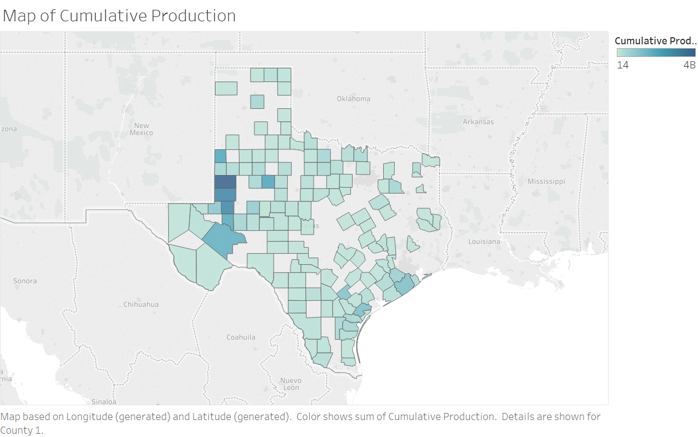
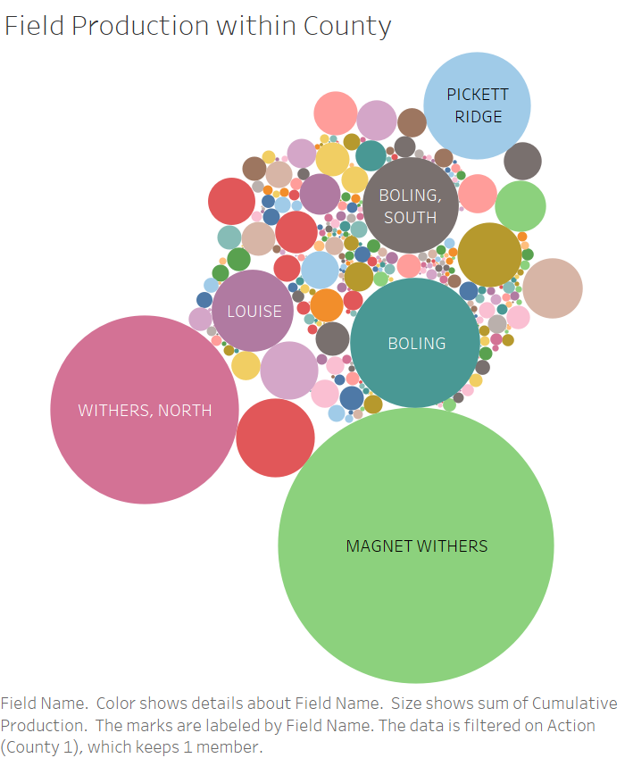
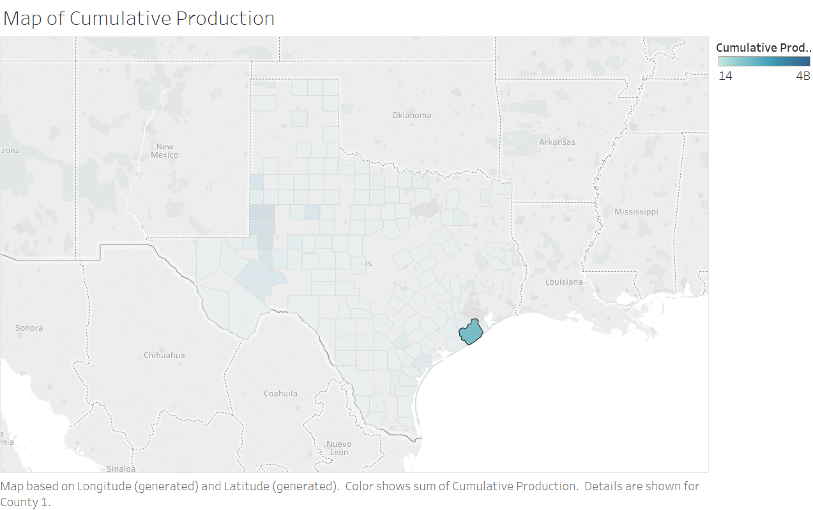
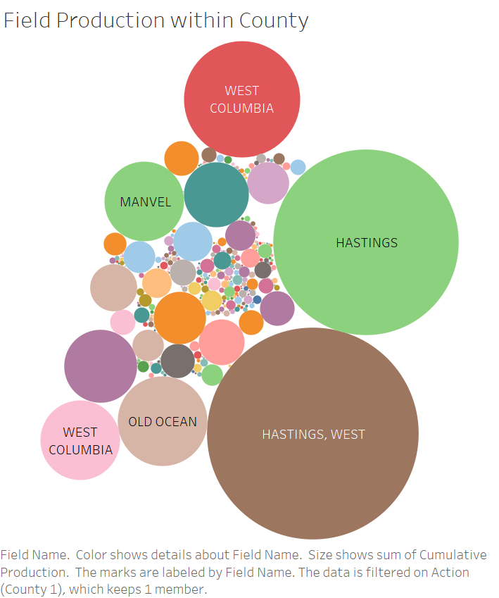
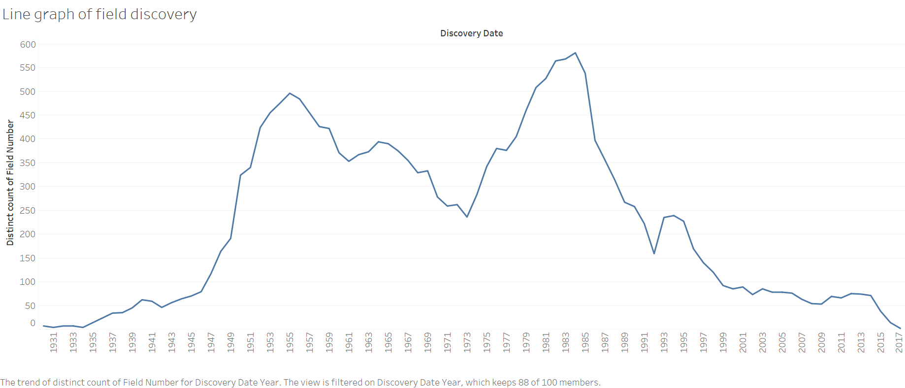
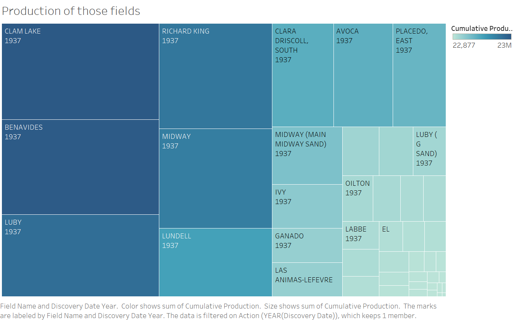
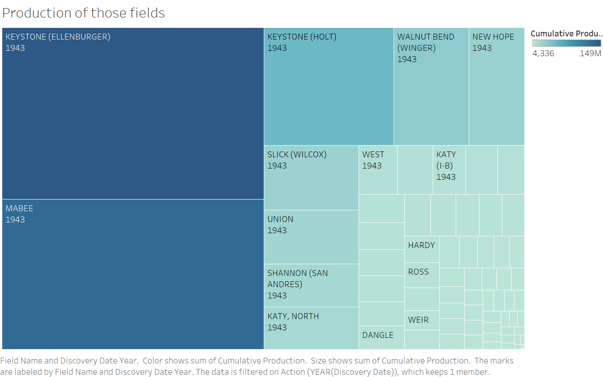
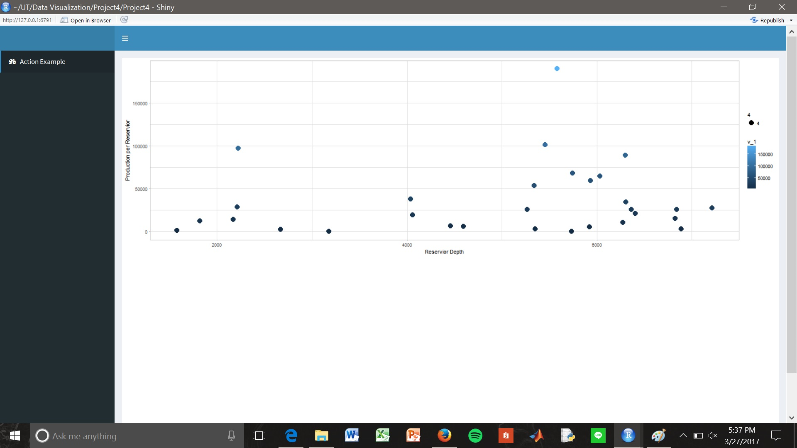
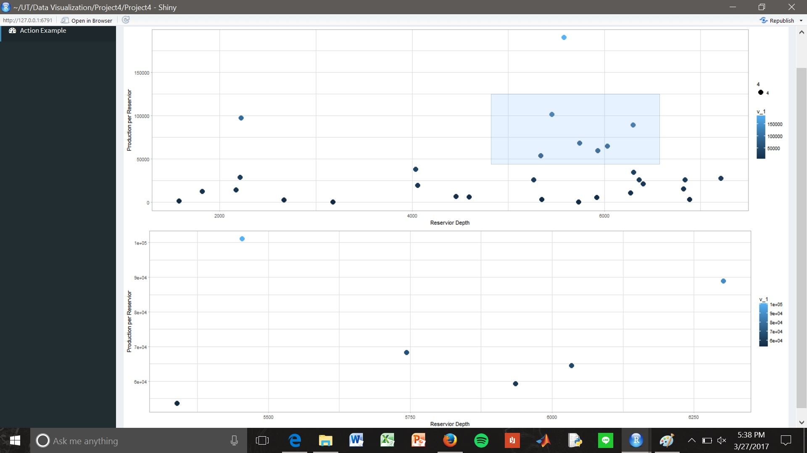

```{r setup, include=FALSE}
knitr::opts_chunk$set(echo = TRUE)
```
d
##**Introduction**

This page shows four different visualizations and actions using Tableau, and one action in Shiny. Each of them are different depictions of data from oil wells in Texas.

###R Configuration
Below we display our sessionInfo().
```{r sessionInfo}
sessionInfo(package=NULL)
```
A
###Downloading the CSV from data.world

To download our document, go to https://data.world/mwillett/s-17-edv-project-3, and click on the "download" button on the top right of the page. The file will be called OilData.csv. This is not the original dataset -- it has been cleaned using our ETL file.


##**The Data**
###Visualization 1 and 2: (Cumulative Production by County)
The following is a visualization of the state of texas representing oil production by county. The Darker the shade of blue, the more production. 


When you click on a county it will then bring you to a worksheet that shows the oil fields in that specific county. The larger the circle, the more production for that field. Displayed is 4 images that shows the selected county and the worksheet that will display. 

###First Selection: Wharton County



###Second Selection: Brazoria County




###Visualization 3 and 4: (Field Discovery Date)
The following visualization is a line graph showing the amount of fields discovered in each year dating back to 1930. When you click on a specific year on the line, it will bring you to a treemap showing the production of those fields. The darker and larger the field, the more production that field has put out. 


###First Selection: 1937



###Second Selection: 1943



##Shiny Action

For the shiny selection, the production and reservior depth were plotted against each other. The shiny application allows the user to click and drag to draw a box and select points. These points will then be displayed below the original plot. The new plots color scale will then rescale with the new points. Additionally, the project was published to Shiny. This application can be accessed here: https://jadair117.shinyapps.io/Project4/

###The original plot


###The display with points selected


